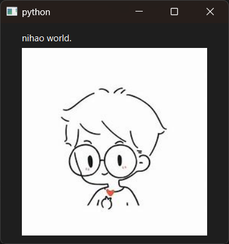

# Introduction

PyQt6 QLabel example.

Launch, it will display "hello world.", after 3 seconds, dispaly "nihao world.".


# Screenshot




# API

English:

- [QApplication](../../Class-0/QtWidget/QApplication.md)
- [QWidget](../../Class-0/QtWidget/QWidget.md)
- [QLabel](../../Class-0/QtWidget/QLabel.md)
- [QTimer](../../Class-0/QtWidget/QTimer.md)

Chinese:

- [QApplication](../../Class-0/QtWidget/QApplication.CN.md)
- [QWidget](../../Class-0/QtWidget/QWidget.CN.md)
- [QLabel](../../Class-0/QtWidget/QLabel.CN.md)
- [QTimer](../../Class-0/QtWidget/QTimer.CN.md)


# Usage

```bash
$ python --version
Python 3.12.3
$ python main.py
```
