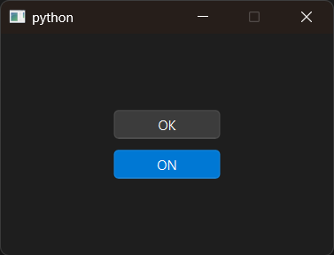

# Introduction

PyQt6 QPushButton example.


# Screenshot




# API

English:

- [QPushButton](../../Class-0/QtWidget/QPushButton.md)
- [QMessageBox](../../Class-0/QtWidget/QMessageBox.md)

Chinese:

- [QPushButton](../../Class-0/QtWidget/QPushButton.CN.md)
- [QMessageBox](../../Class-0/QtWidget/QMessageBox.CN.md)


# Usage

```bash
$ python main.py
```
