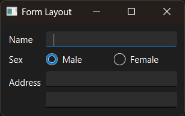

# Introduction

PyQt6 QFormLayout example.


# Screenshot




# API

English:

- [QFormLayout](../../Class-0/QtWidget/QFormLayout.md)

Chinese:

- [QFormLayout](../../Class-0/QtWidget/QFormLayout.CN.md)


# Usage

```bash
$ python main.py
```
