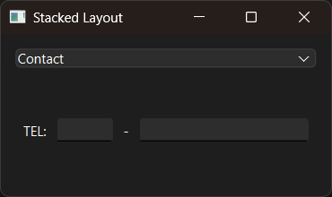

# Introduction

PyQt6 QStackedLayout example.


# Screenshot




# API

English:

- [QStackedLayout](../../Class-0/QtWidget/QStackedLayout.md)

Chinese:

- [QStackedLayout](../../Class-0/QtWidget/QStackedLayout.CN.md)


# Usage

```bash
$ python main.py
```
