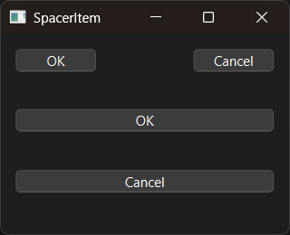

# Introduction

PyQt6 horizontal/vertical spacer example.


# Screenshot




# API

English:

- [QSpacerItem](https://doc.qt.io/qtforpython-6/PySide6/QtWidgets/QSpacerItem.html)


# Usage

```bash
$ python main.py
```
