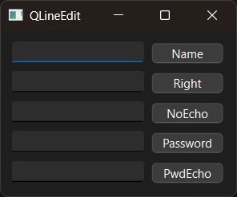

# Introduction

PyQt6 QLineEdit example.


# Screenshot




# API

English:

- [QLineEdit](../../Class-0/QtWidget/QLineEdit.md)

Chinese:

- [QLineEdit](../../Class-0/QtWidget/QLineEdit.CN.md)


# Usage

```bash
$ python main.py
```
