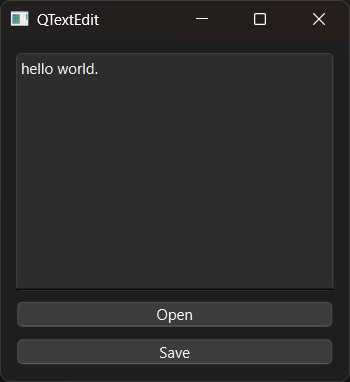

# Introduction

PyQt6 QTextEdit example.


# Screenshot




# API

English:

- [QTextEdit](../../Class-0/QtWidget/QTextEdit.md)

Chinese:

- [QTextEdit](../../Class-0/QtWidget/QTextEdit.CN.md)


# Usage

```bash
$ python main.py
```
