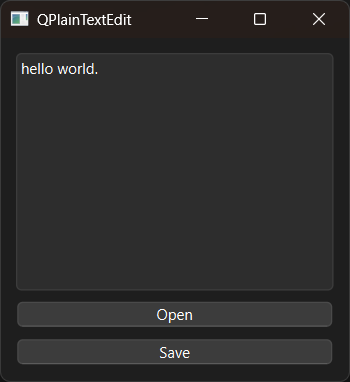

# Introduction

PyQt6 plain text edit example.


# Screenshot




# API

- [QPlainTextEdit](https://doc.qt.io/qtforpython-6/PySide6/QtWidgets/QPlainTextEdit.html)


# Usage

```bash
$ python main.py
```
